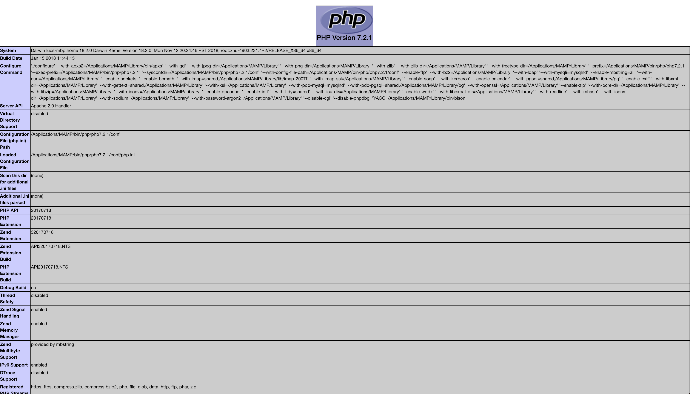

## Opdracht 00: Installeren

### Voorbereiding
Zorg dat je XAMPP hebt geinstalleerd

### In te leveren bestanden
1) `phpinfo.php`

### Opdracht
Je weet nu hoe je PHP kunt gebruiken in je terminal. Het wordt tijd dat we overschakelen naar de browser. Je hebt een PHP web server nodig om lokaal PHP in de web browser uit te voeren. Wij gaan daarvoor XAMPP gebruiken.

### Output
Als je phpinfo.php in je browser opent hoort het er ongeveer zo uit te zien

### Notities
Zorg ervoor dat `display_errors` in de `Local Value` kolom op `on` staat. Google hoe je dit kunt aanpassen.